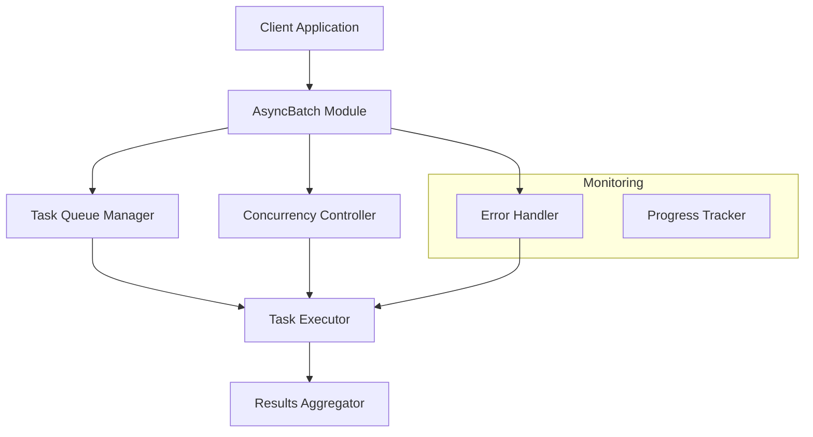
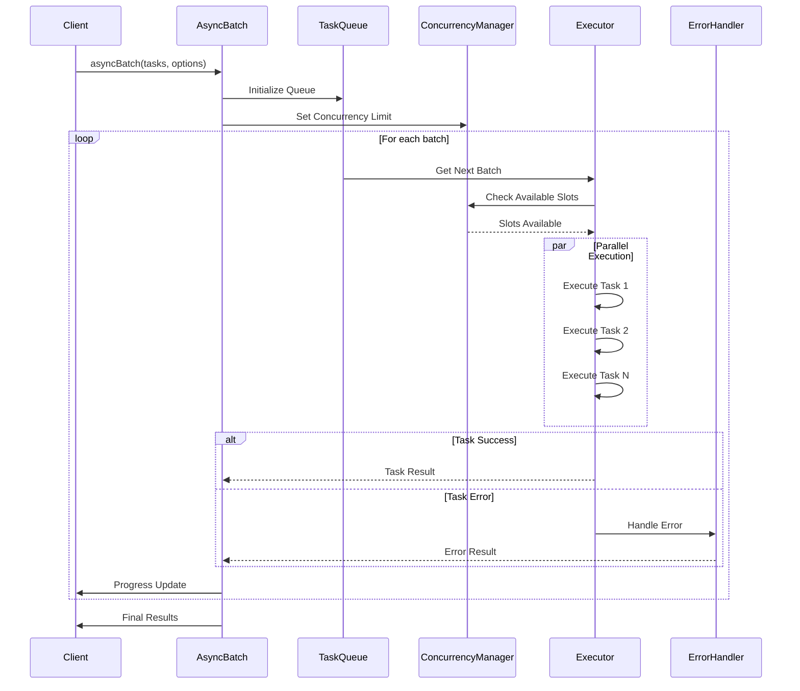

# bodhi-async-batch

A powerful utility for running asynchronous tasks in batches with controlled concurrency. Perfect for handling API calls, database operations, and file processing tasks with optimal performance and resource management.

## Language Support

`bodhi-async-batch` is built with dual language support:
- **TypeScript**: Full TypeScript support with type definitions
- **JavaScript**: Native JavaScript support (ES6+)
- **Module Formats**: Supports both CommonJS (`require`) and ESM (`import`) formats

[](https://www.npmjs.com/package/bodhi-async-batch)
[](https://www.typescriptlang.org/)
[](https://opensource.org/licenses/MIT)


## Installation

```bash
npm install bodhi-async-batch
```

### TypeScript Usage
```typescript
import { asyncBatch } from 'bodhi-async-batch';

interface User {
  id: number;
  name: string;
}

const tasks = [
  async () => fetchUser(1),
  async () => fetchUser(2),
  async () => fetchUser(3)
];

const results = await asyncBatch<User>(tasks, {
  concurrency: 2,
  failFast: true,
  onProgress: (completed, total) => console.log(`Progress: ${completed}/${total}`)
});
```

### JavaScript Usage
```javascript
const { asyncBatch } = require('bodhi-async-batch');

const tasks = [
  async () => fetchUser(1),
  async () => fetchUser(2),
  async () => fetchUser(3)
];

const results = await asyncBatch(tasks, {
  concurrency: 2,
  failFast: true,
  onProgress: (completed, total) => console.log(`Progress: ${completed}/${total}`)
});
```


## 🏗️ Architecture

### High-Level Design (HLD)



### Low-Level Design (LLD)



### Technical Architecture

1. **Entry Points**
   - JavaScript (CommonJS): `dist/index.js`
   - JavaScript (ESM): `dist/index.mjs`
   - TypeScript: `dist/index.d.ts`

2. **Core Components**
   ```
   bodhi-async-batch/
   ├── src/
   │   ├── index.ts        # TypeScript implementation
   │   └── index.js        # JavaScript implementation
   ├── dist/
   │   ├── index.js       # Compiled CommonJS
   │   ├── index.mjs      # Compiled ESM
   │   └── index.d.ts     # Type definitions
   └── tools/
       └── create-mjs.js  # ESM converter
   ```

3. **Key Interfaces**
   ```typescript
   interface AsyncBatchOptions {
     concurrency?: number;    // Parallel execution limit
     failFast?: boolean;      // Error handling strategy
     onProgress?: Function;   // Progress callback
   }
   ```

4. **Processing Flow**
   - Task Queue Management
   - Concurrency Control
   - Error Handling
   - Progress Tracking
   - Results Aggregation

## 🌟 Features

- 🔄 Run async tasks with controlled concurrency
- 📦 Maintain result order regardless of completion order
- ⚠️ Configurable error handling (fail-fast or continue-on-error)
- 📊 Real-time progress tracking
- 🎯 Zero runtime dependencies
- 📘 Full TypeScript support with type definitions
- ✅ Comprehensive test coverage
- 🛠️ Perfect for:
  - API calls and web requests
  - File system operations
  - Database queries
  - Image processing
  - Data transformation
  - Any async task that needs batching

## Usage

### Basic Example

```typescript
import { asyncBatch } from 'bodhi-async-batch';

const tasks = [
  () => fetchUserData(1),
  () => fetchUserData(2),
  () => fetchUserData(3),
];

const results = await asyncBatch(tasks, { 
  concurrency: 2 
});
```

### With Progress Tracking

```typescript
const results = await asyncBatch(tasks, {
  concurrency: 3,
  onProgress: (completed, total) => {
    console.log(`Progress: ${completed}/${total}`);
  }
});
```

### Error Handling

```typescript
// Fail-fast mode
try {
  const results = await asyncBatch(tasks, { failFast: true });
  console.log('All tasks completed successfully:', results);
} catch (error) {
  console.error('Processing stopped due to error:', error);
}

// Continue-on-error mode (default)
const results = await asyncBatch(tasks);
// Results array may contain both successful results and errors
```

## API

### asyncBatch<T>(tasks, options)

#### Parameters

- `tasks: (() => Promise<T>)[]`
  Array of functions that return promises

- `options?: object`
  - `concurrency?: number` (default: 5)
    Maximum number of tasks to run simultaneously
  - `failFast?: boolean` (default: false)
    If true, stops processing on first error
  - `onProgress?: (completed: number, total: number) => void`
    Optional callback for progress updates

#### Returns

- `Promise<T[]>`
  Promise that resolves with array of results in the same order as input tasks

## Error Handling

- In fail-fast mode (`failFast: true`), the first error encountered will reject the promise
- In continue-on-error mode (default), errors are collected in the results array
- If all tasks fail, an error is thrown with all error messages combined

## Performance Considerations

- Tasks are processed in batches based on the concurrency limit
- Memory usage is optimized by not storing all task results in memory at once
- Error handling is designed to minimize overhead in both fail-fast and continue-on-error modes
- Progress tracking has minimal impact on performance

## Contributing

1. Fork the repository
2. Create your feature branch (`git checkout -b feature/amazing-feature`)
3. Commit your changes (`git commit -m 'Add some amazing feature'`)
4. Push to the branch (`git push origin feature/amazing-feature`)
5. Open a Pull Request

### Development

```bash
# Install dependencies
npm install

# Run tests
npm test

# Build the package
npm run build

# Lint the code
npm run lint

# Format the code
npm run format
```

## Compatibility

- Node.js ≥ 14.0.0
- Works in both CommonJS and ESM environments
- Browser compatible (via bundlers)

## 🎯 Real-World Use Cases

### API Calls with Retry
```typescript
const fetchWithRetry = async (url: string, retries = 3) => {
  for (let i = 0; i < retries; i++) {
    try {
      const response = await fetch(url);
      if (response.ok) return response.json();
      throw new Error(`HTTP ${response.status}`);
    } catch (error) {
      if (i === retries - 1) throw error;
      await new Promise(resolve => setTimeout(resolve, 1000 * Math.pow(2, i)));
    }
  }
};

const userIds = [1, 2, 3, 4, 5];
const tasks = userIds.map(id => () => 
  fetchWithRetry(`https://api.example.com/users/${id}`)
);

const results = await asyncBatch(tasks, {
  concurrency: 2,
  onProgress: (done, total) => console.log(`Fetched ${done}/${total} users`)
});
```

### File Processing Pipeline
```typescript
const files = await fs.readdir('images');
const tasks = files.map(file => async () => {
  const content = await fs.readFile(`images/${file}`);
  const processed = await processImage(content);
  await fs.writeFile(`output/${file}`, processed);
  return { file, size: processed.length };
});

const results = await asyncBatch(tasks, { concurrency: 3 });
```

### Database Operations
```typescript
const records = await db.query('SELECT * FROM users');
const tasks = records.map(record => async () => {
  await db.transaction(async (trx) => {
    await trx('users').update({ processed: true }).where({ id: record.id });
    await trx('audit').insert({ user_id: record.id, action: 'process' });
  });
});

const results = await asyncBatch(tasks, {
  concurrency: 5,
  failFast: true
});
```

## 🔍 Advanced Usage

### Custom Error Handling
```typescript
const results = await asyncBatch(tasks, {
  failFast: false,
  onProgress: (done, total) => console.log(`${done}/${total} completed`)
});

// Handle errors in results
const errors = results.filter(r => r instanceof Error);
const successes = results.filter(r => !(r instanceof Error));

console.log(`Completed: ${successes.length}, Failed: ${errors.length}`);
```

### Dynamic Concurrency
```typescript
// Adjust concurrency based on system resources
const concurrency = Math.min(os.cpus().length, 10);
const results = await asyncBatch(tasks, { concurrency });
```

## 🤝 Contributing

Contributions are welcome! Please feel free to submit a Pull Request. For major changes, please open an issue first to discuss what you would like to change.

1. Fork the repository
2. Create your feature branch (`git checkout -b feature/amazing-feature`)
3. Commit your changes (`git commit -m 'Add some amazing feature'`)
4. Push to the branch (`git push origin feature/amazing-feature`)
5. Open a Pull Request

## 📝 License

MIT

## 🌟 Project Details

This project was created to solve the common challenge of processing large numbers of async tasks efficiently while maintaining control over system resources. Whether you're making API calls, processing files, or handling database operations, `bodhi-async-batch` provides a simple yet powerful solution for batch processing with controlled concurrency.

## 👨‍💻 Creator

Made with ❤️ by BODHEESH

### Connect with me
If you have any questions about my projects or want to discuss potential collaboration opportunities, please don't hesitate to connect with me. You can reach me through the following channels:

- 📧 Email: bodheeshvc.developer@gmail.com
- 💼 LinkedIn: [linkedin.com/in/bodheeshvc](https://linkedin.com/in/bodheeshvc)
- 🐱 GitHub: [github.com/BODHEESH](https://github.com/BODHEESH)
- 📺 Youtube: [youtube.com/@BodhiTechTalks](https://youtube.com/@BodhiTechTalks)
- 📝 Medium: [medium.com/@bodheeshvc.developer](https://medium.com/@bodheeshvc.developer)
- 🐦 Twitter: [x.com/Bodheesh_](https://x.com/Bodheesh_)

I'm always happy to connect with other professionals in the tech industry and discuss ways to work together. Feel free to reach out and let's see how we can help each other grow and succeed!
